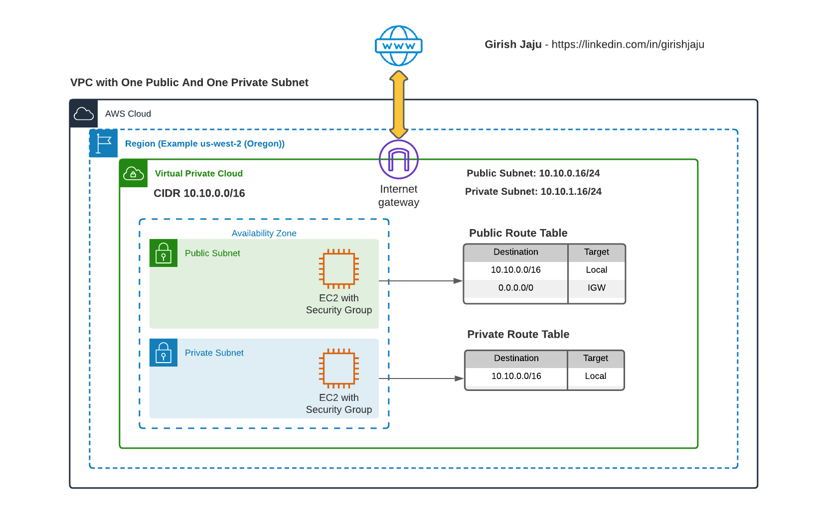

# Setup AWS VPC with One Public And One Private Subnets

## Prerequisite
Please follow the part 1, where we created the VPC, Public Subnet.
### Link: [VPC With One Public Subnet](/aws-vpc-and-networking/01-vpc-one-public-subnet/)

## Architecure

## Detailed Steps:
### Create Private Subnet
1. On the VPC-1 that we created in previous step (See Prerequisite)
2. Create a Subnet named VPC-1-Private-Subnet with CIDR range (10.10.1.0/24)
3. Create a Route table named (VPC-1-Private-RT)
4. Add VPC-1-Private-Subnet to the Route table

### EC2 on VPC 1
1. Lauch an EC2 machine with t2.micro
2. On the Security Group setting, create a new Security Group - VPC-1-Private-SG 
   Allow SSH access from Security Group VPC-1-Public-SG 
3. Assign the IAM role VPC-1-EC2-S3-Role to the instance (Role created in previous step, see Prerequisite) 
4. SSH into the instance on the Public subnet (From Previous step)
5. Copy the content (private key of the keypair using cat name of keypair, vi and create a file called NOVA.pem using the cmd vi nova.pem and paste the private key :wq! to exit) of the downloaded PEM file on the Public instance.
6. SSH from Public instance to Private Subnet's EC2 instance using the Private IP address as it has no public IP
4. Verify the following commands are NOT working
    - ping google.com
    - aws s3 ls

### Conclusion

Successfully created a Private Subnet in the VPC. 
We are able to SSH into the EC2 instance on private subnet from Public subnet's EC2 instance.
There is no Internet connectivity on the Private instance
